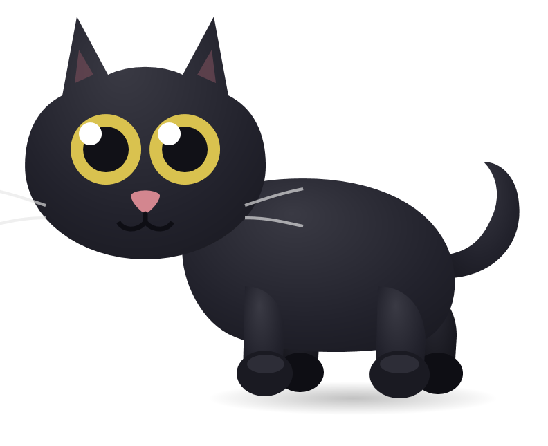

# 부각이 🐈‍⬛

**바탕화면을 어슬렁거리는 검은 고양이 + 뽀모도로 타이머**

설치 필요 없음 · 윈도우면 더블클릭 한 번 · 용량 20KB

[**⬇️ 다운로드**](부각이_데스크탑고양이.zip?raw=1) &nbsp;·&nbsp; [사용법](사용법.txt)

---

## 뭐 하는 애냐면

부각이는 창을 차지하지 않고 **바탕화면 위를 그냥 돌아다닙니다.** 일하는 동안 옆에서 걸어다니고, 세수하고, 기지개 켜고, 하품하고, 가끔 식빵을 굽습니다.

그리고 **뽀모도로 타이머**를 겸합니다. 집중 시간엔 조용히 식빵 굽고 졸다가, 쉬는 시간이 되면 "야옹" 하고 울며 밥그릇을 꺼내요.

## 이렇게 놀아주세요

| 조작 | 반응 |
|---|---|
| 몸통·머리 **왼쪽 클릭** | 쓰다듬기 → 앞발로 **꾹꾹이** |
| **궁댕이 클릭** (또는 우클릭) | **궁디팡팡** → 꼬리 번쩍 들고 좋아함 ♪ |
| 부각이를 **누른 채 끌기** | 원하는 자리로 옮기기 (놓으면 거기서 멈춤) |
| 마우스를 **가까이** 가져가기 | 눈동자가 커서를 따라오다가, 몸 낮추고 **앞발로 낚아챔** (핑크 젤리 보임) |

가만히 둬도 알아서 삽니다 — 걷기 · 앉기 · 세수 · 기지개 · 하품 · 꾹꾹이 · 식빵굽기 · 가끔 꼬리 툭.

> 고양이는 강아지처럼 꼬리를 계속 흔들지 않아요. 평소엔 가만히 있다가 가끔 한 번 툭 튕깁니다. 사냥할 때만 실제로 살랑거려요.

## 뽀모도로 타이머

작업표시줄 오른쪽 아래 **트레이의 고양이 아이콘을 우클릭**하세요.

- **집중 시작** — 부각이가 식빵을 구우며 조용히 기다립니다 (`z z Z`)
- **휴식 시작** — 야옹! 하고 울고 밥그릇이 나타납니다
- **시간 설정** — 집중/휴식 시간을 분 단위로 직접 지정 (25/5, 50/10, 15/3 프리셋도 있음)
- **크기 조절** — 모니터에 비해 크거나 작으면 여기서 조절
- **부각이 재우기** — 종료

쉬는 시간에 **밥그릇을 클릭하면 사료가 쌓이고**, 부각이가 고개를 숙여 오물오물 먹습니다. 안 주면 중간중간 "야옹" 하고 보채요.

설정한 시간과 크기는 저장돼서 다음에 켜도 그대로입니다.

## 설치

1. [**부각이_데스크탑고양이.zip**](부각이_데스크탑고양이.zip?raw=1) 다운로드
2. **압축 풀기** (ZIP 안에서 바로 실행하면 안 됩니다)
3. **`고양이_실행.vbs`** 더블클릭

설치할 프로그램도, 파이썬도, 아무것도 필요 없습니다. 윈도우에 기본으로 있는 PowerShell로만 돌아갑니다.

**컴퓨터 켤 때 자동으로 나오게 하려면** `AutoStart.bat` 더블클릭 (같은 파일 다시 누르면 꺼짐)

## 다운로드할 때 경고가 뜨면

**정상입니다. 파일이 잘못된 게 아니에요.**

부각이는 `.vbs` `.bat` `.ps1` 같은 **스크립트 파일**로 되어 있습니다. 크롬과 윈도우는 스크립트가 든 압축 파일을 보면 내용과 상관없이 자동으로 경고를 띄웁니다. 서명(코드 사인) 인증서가 없는 개인 프로그램은 전부 그래요.

| 어디서 | 뭐라고 뜨나 | 어떻게 |
|---|---|---|
| 크롬 다운로드 | "일반적으로 다운로드되지 않는 파일이며 위험할 수 있습니다" | 다운로드 항목의 **⋮ → 계속** (또는 **유지**) |
| 압축 풀 때 / 실행 시 | "Windows의 PC 보호" 파란 창 | **추가 정보 → 실행** |

찜찜하시면 다운로드한 ZIP을 [VirusTotal](https://www.virustotal.com/gui/home/upload) 에 올려서 검사해 보셔도 됩니다. 소스 코드는 이 저장소에 전부 공개되어 있어요 — [`CatPet.ps1`](CatPet.ps1) 하나가 전부입니다.

## 안 켜질 때

| 증상 | 해결 |
|---|---|
| 파란 보안 경고창 | **추가 정보 → 실행** |
| 더블클릭해도 아무 반응 없음 | **`RUN.bat`** 실행 (백신이 `.vbs`를 막는 경우가 많아요) |
| 파일 이름이 깨져 보임 | `RUN.bat`은 영문 이름이라 그대로 동작합니다 |
| 그래도 안 됨 | `사용법.txt`의 "안 켜질 때" 6단계 참고 |

## 새 버전 알림

부각이는 켜진 뒤 한 번, 이 저장소의 `version.txt`만 읽어서 새 버전이 있는지 확인합니다. 새 버전이 있으면 알림이 뜨고, 트레이 메뉴에 **"새 버전 받기"** 가 생겨요.

> **인터넷에서 코드를 받아 실행하지 않습니다.** 버전 번호 한 줄만 읽고 비교할 뿐이라, 알림을 보고 직접 받으실지 결정하시면 됩니다. 트레이 메뉴에서 언제든 수동으로 확인할 수도 있어요.

## 만든 거

- **윈도우 전용** (WPF + PowerShell, 외부 라이브러리 0개)
- 고양이는 **전부 벡터 도형으로 직접 그렸습니다** — 이미지 파일 없음
- 울음소리도 **코드로 합성**했습니다 (사운드 파일 없음)
- 125%·150% 화면 배율에서도 크기와 위치가 안 틀어지게 처리
- 실제 모델이 있는 고양이입니다 🐈‍⬛
